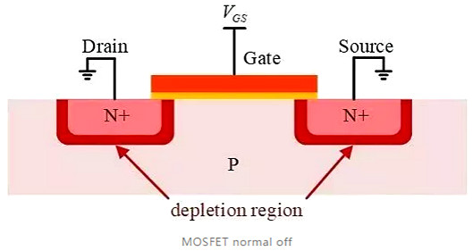

# CPU，从出土到入土
## 目录  
1. [简介](#简介)
2. [第一节-(出土)如何从沙子变成单晶硅](#第一节-如何从沙子变成单晶硅)
3. [第二节-半导体物理简单入门](#第二节-半导体物理简单入门)
4. [第三节-数字电路基础](#第三节-数字电路基础)
5. [第四节-CPU基本原理](#第四节-CPU基本原理)
6. [第五节-(入土)总结](#第五节-(入土)总结)

## 经典疑问导航
1. [问题1-为何我们常讨论10寸、12寸晶圆，晶圆大小有什么好处？](#问题1-为何我们常讨论10寸、12寸晶圆，晶圆大小有什么好处？)
2. [问题2-我们常说的CMOS相机和这有什么关系](#问题2-我们常说的CMOS相机和这有什么关系)

## 简介  
&emsp;&emsp;这篇文章将要告诉你沙子是怎样变成CPU的。在文章的过程中，我会讨论一些日常生活常讨论的问题，比如CPU频率与功耗的关系。其中很多内容，只求了解，不求深入，因为深入去讲会有更多错误暴露出来（学艺不精）。本文可能出现错误，欢迎指正。  
  
  
## 第一节-如何从沙子变成单晶硅
  
&emsp;&emsp;为了不劝退太多人，将比较简单的内容安排在第一节，也许这个安排会比较好。  
&emsp;&emsp;高中化学告诉我们，地壳中含量最多的元素分别是氧、硅、铝、铁，沙子的主要成分就是二氧化硅。然后使用化学的方式（知识盲区，阿巴阿巴）进行粗提纯。这样得出来的硅的纯度，是远远不够的。想要做集成电路芯片，纯度至少达到99.999999%，小数点后6个9，而且先进的工艺对纯度要求远不止6个9。然后使用物理方式：杂质在结晶的固体和未结晶的液体中浓度不同，将硅部分区域加热，即可使得杂质往某个方向移动，反复操作，即可得到十分高纯度的区域，这就是区熔提纯。  
&emsp;&emsp;我们老师常说，女朋友要买金饰时要说：什么4K金，99金，都不如一片晶圆纯（单身秘籍）。  
&emsp;&emsp;接下来要将一些非晶体变成单晶，然后切割成晶圆。单晶和多晶的概念高中应该有讲过，此处不赘述。方法就是把上面超高纯度的硅熔融至熔点，然后将一粒籽晶（较小的单晶硅）插入熔融硅中，慢慢往上拉，临界状态的硅液体会附着在籽晶上，并且按照一定的晶向生长。如图。  
  
  
&emsp;&emsp;到这里，我们就得到了这个又黑又粗又长的单晶硅了。那么，如何得到一片未被加工过的晶圆呢？根据晶体的各项异性，在某个方向的面之间作用力会比较弱，只需要在边缘敲一下，整个面就会十分光滑地分割了出来。如下图。
  
### 问题1-为何我们常讨论10寸、12寸晶圆，晶圆大小有什么好处
&emsp;&emsp;接下来要做的微加工的每一步，都是很耗钱的，晶圆越大，就能在一次完整的集成电路微加工中，得到更多的芯片，减小成本。  
  
&emsp;&emsp;至此，我们粗略知道了如何得到一块纯净的单晶硅晶圆。接下来我会简单介绍一些半导体、电路理论  

## 第二节-半导体物理简单入门
  
&emsp;&emsp;硅是Ⅳ族元素，每个硅原子与周围4个硅原子共用一个电子形成共价键，硅的化学性质十分稳定，电子不易电离出来。金属在常温下有大量的自由电子可以导电，自由电子移动从而形成大电流，所以我们称之为导体。1立方厘米的硅内有5×10^22次方的硅原子，而常温下只有1.5×10^10个电子被电离出来，可以移动形成电流。这个数量十分小，因此纯的单晶硅的电阻十分大，介于绝缘体和导体之间。  
&emsp;&emsp;我们可以通过掺杂杂质，使得杂质替换某个硅原子中的位置。掺入Ⅴ族元素比如磷P，磷最外层有5个电子，4个电子和附近的硅成键，剩下一个电子形成可以移动的电子，我们把这种杂质称为施主杂质，得到的掺杂半导体称为N型半导体。掺入Ⅲ族元素比如硼B，那么3个键与附近硅成键，有一个邻近的硅原子未与磷成键，那么形成一个空位，当电子移动到这个位置时，这个空位会被填补，但是同时也形成了一个空位，我们把空位定义为空穴。(空穴不是一个真实存在的物质，它代表电子的群体运动，就像水中的气泡，你能看到气泡运动，实质上气泡里面是空气，气泡在运动是因为周围的水填充了它的位置从而使得气泡在移动)。我们把掺杂Ⅲ族元素的半导体定义为P型半导体，我们把这种杂质称为受主杂质。  
  
&emsp;&emsp;至此，我们了解了N型半导体与P型半导体，接下来问题是：这样的半导体如何变成最基本的电路单元。半导体内，掺杂了杂质，浓度范围为每立方厘米10的12至17次方个杂质原子。其中杂质会在常温下电离出电子或空穴（统称载流子），这些载流子可以在半导体内移动。注意的是，电子不会凭空消失或者尝试，掺杂过程中，半导体由始至终都保持电中性。将P型半导体与N型半导体接触在一起，N型半导体电子浓度高，P型半导体空穴浓度高，载流子会从浓度高区域扩散到浓度低的区域，那么N型半导体电子穿过接触面到达P型半导体，P型半导体空穴穿过接触面到达N型半导体。由此，在接触面的附近会形成一层比较薄的空间电荷区，因为该区域内N型半导体失去电子，所以带正电荷（因为原子核电荷比核外电子多），同理，另一边的P型半导体带负电。由此形成一个空间电荷区，空间电荷区形成一个内电场（高中知识：正负电荷之间的电场），阻止载流子进一步扩散，形成平衡。  
  
&emsp;&emsp;向P型半导体加的电压大于N型半导体时，外加电压所形成的电场会减弱内电场。当外加电压大于内电场，就会有比较大的电流。相反，向P型半导体加的电压小于N型半导体时，外加电压所形成的电场会增大内电场，使得载流子更加难流动。  
&emsp;&emsp;**这就是二极管的原理！**  
  
&emsp;&emsp;接下来我们要探讨如何制作集成电路最经典的器件——MOS场效应晶体管。比较复杂，看不懂可以直接跳到开关模型。
  
&emsp;&emsp;MOS晶体管共有4个端口，分别为源(Source)、栅(Gate)、漏(Drain)、衬底(Bulk)，源极与漏极是对称的，一般NMOS电压高的是漏，低的是源。上图为一个NMOS，橙色部分为金属，黄色部分为氧化物(比如二氧化硅)，灰色部分为衬底（P型掺杂硅），淡红色部分为N型硅，红色部分为P型硅与N型硅形成的空间电荷区。若把衬底加0V，源漏加正压，可以保证在正常工作情况下，PN结是处于反向区(即二极管绝缘)。在图中源、漏接地的情况下，在栅极上面加一个正点压，正电压会吸引P型硅衬底中的电子到栅极下的晶片表面处，当加的正向偏压足够大时（阈值电压），会在表面处形成一层电子积聚的导电沟道，这条导电沟道连接源极与漏极。若VGS与VGD都小于阈值电压，那么源漏之间不形成导电沟道，源漏之间电流极小，视为关断。VGS与VGD都大于阈值电压，形成导电沟道，那么源漏之间就能导电。  
&emsp;&emsp;只要把上图中的P型掺杂改成N型掺杂，N型掺杂改成P型掺杂，那么就是PMOS。有所不同的是，PMOS衬底要加正电压才能保证正常工作，PMOS的VSG和VDG大于阈值电压才能形成导电通道。

&emsp;&emsp;**开关模型**  
&emsp;&emsp;简单来说，NMOS在数字电路中，可以十分粗暴地理解为一个开关，栅极加高电平（数字电路中的1逻辑的正电压）开关就开启。PMOS加低电平就开启。  
&emsp;&emsp;至此，我们就十分“通俗"地解释怎么从一块纯净的单晶硅，变成集成电路中的常用器件了。我们常说的CMOS，即complex MOS，即NMOS+PMOS。这个名称的由来是由于早期由于工艺技术限制，NMOS十分难制造，所以电路使用PMOS完成逻辑，但是只使用PMOS器件会带来较高的静态功耗，使用NMOS+PMOS的静态功耗会远小于只使用PMOS。

### 问题2-我们常说的CMOS相机和这有什么关系
&emsp;&emsp;大概是所使用的传感器与CCD电荷耦合传感器有区别，CMOS相机所使用的传感器是基于CMOS工艺的，CCD不是。

## 第三节-数字电路基础
&emsp;&emsp;世界上有10种人，其中一种是不知道二进制的人，一种是知道二进制的人，还有一种是认为这是三进制的人——鲁迅。  

### 问题3-为什么是使用二进制  
&emsp;&emsp;二进制有2种状态0和1，十分好地对应与电路中的高电平（高电压）与低电平（低电压）。使用二进制有比较大的容错范围，一个逻辑电路是有很多级基本逻辑单元组成，在路上可能还会因为电容电感原因导致电压被影响，使用0、1可以容易地把信号传递到另一边，不容易错误。  
  
&emsp;&emsp;排列组合告诉我们，有n个值可以为0或1的变量，那么就有2的n次方个排列。因此，一个8位的二进制，可以表示从0到255之间的值。我们对这个排列的格式一些约定，可以定义出负数在计算机中的表示，即补码。还可以定义出小数的表示，即浮点数。在这种定义的格式下，还可以实现加减乘除法。比如简单的4位无符号整数，二进制0000即表示0，二进制0100即表示4，二进制1011表示11。二进制数的每一位乘以该位对应的权重（该位从右到左位置为i（从0开始数），权重为2的i次方)，相加就可以得到对应的十进制值。比如1011，1*1+1*2+0*4+1*8=11。  
&emsp;&emsp;实现最简单的加法，需要从基本的逻辑运算开始，比如与、或、非（高中知识），只需要非+与（或），就可以组成所有的逻辑。基本逻辑单元级联，就能形成复杂的逻辑。  
  
&emsp;&emsp;接下来要介绍，如何组成一个加法电路。从上图可以看到，异或的真值表所表示的就是1位的加法。0+0=0，1+0=1，1+1=0（向前进位）。那么还有有一个电路，告诉前面一位我要进位，进位的逻辑就是A&B（AB同时为1即进位）。这样，我们就设计出了一个半加器，因为它并不能接收上一级的进位输入。  
&emsp;&emsp;一个全加器可以接收上一级的进位输入，加入上一级的进位为CI，那么加法的逻辑变成:S=A异或B异或CI，进位输出变成CO=A&B+A&CI+B&CI。下图就是一个全加器的原理图。  
  
&emsp;&emsp;把多个全加器级联起来，就能组成一个多位的整数加法器。
  
&emsp;&emsp;到这里，我们就实现了二进制的加法。离成功又近了一步。还有一些基本的逻辑单元，比如译码器（将n位二进制数，解码成2^n个输出信号，当输入的十进制为D时，D输出有效信号，其他都输出无效信号）、选择器（有2^n个通道的信号输入，还有n个地址输入，当地址的十进制为D时，输出为D通道的输入）。电路略微复杂但是不难，有兴趣的可以自行了解。静态的组合逻辑就介绍到这里，接下来是要让电路动起来。  
&emsp;&emsp;我们生活中所接触的电子产品，全部都是有时序的，在每一个周期，电路会执行特定的逻辑。而组合逻辑电路，输出会伴随着输入的改变而改变（伴随着非常非常小的延时）。  
&emsp;&emsp;介绍组合逻辑电路，从方波开始  
 
## 第四节-CPU基本原理

